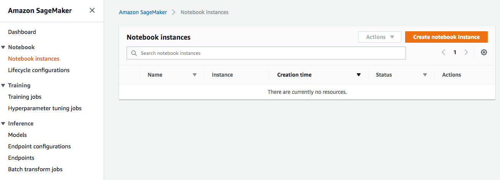
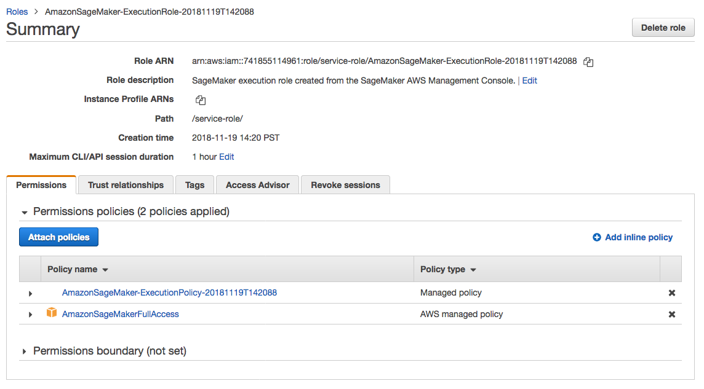
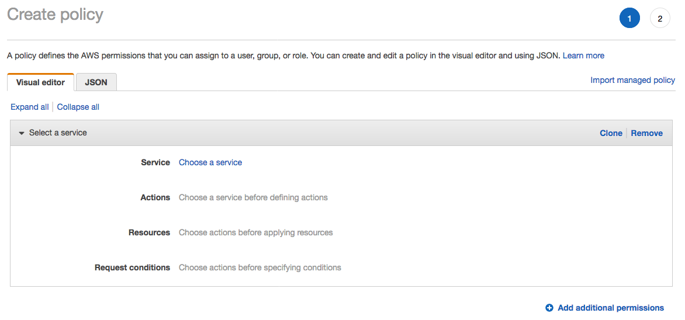
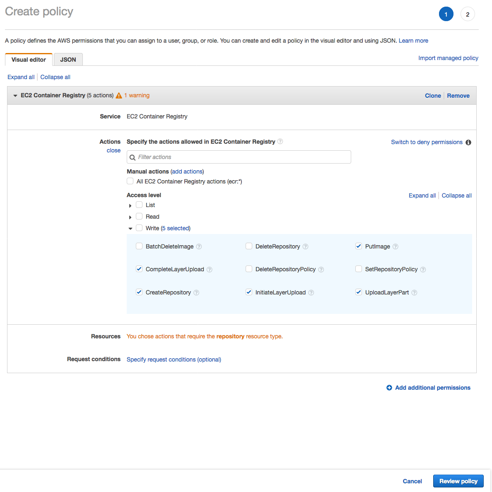
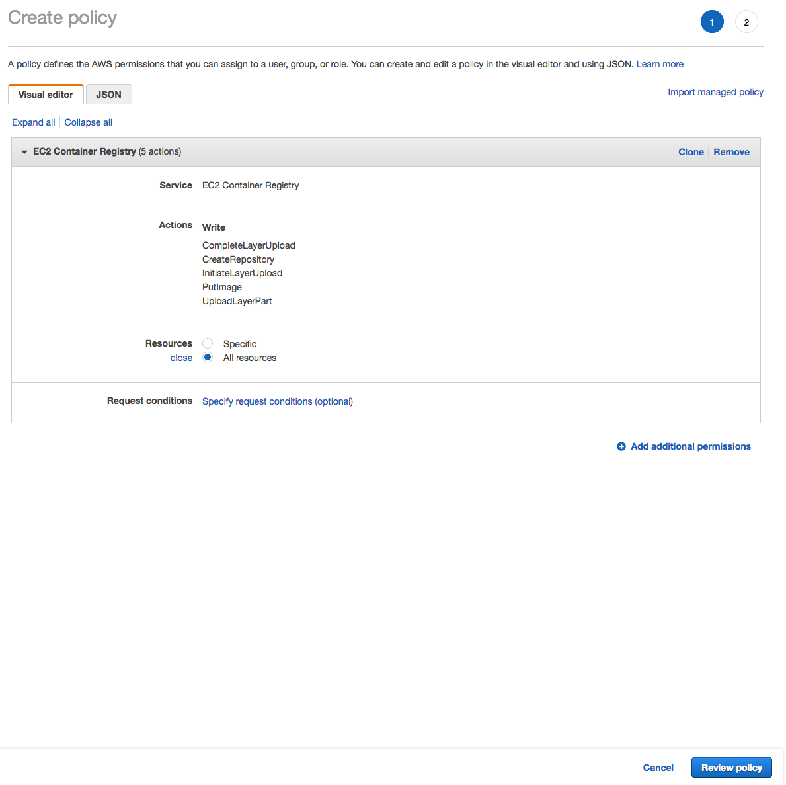
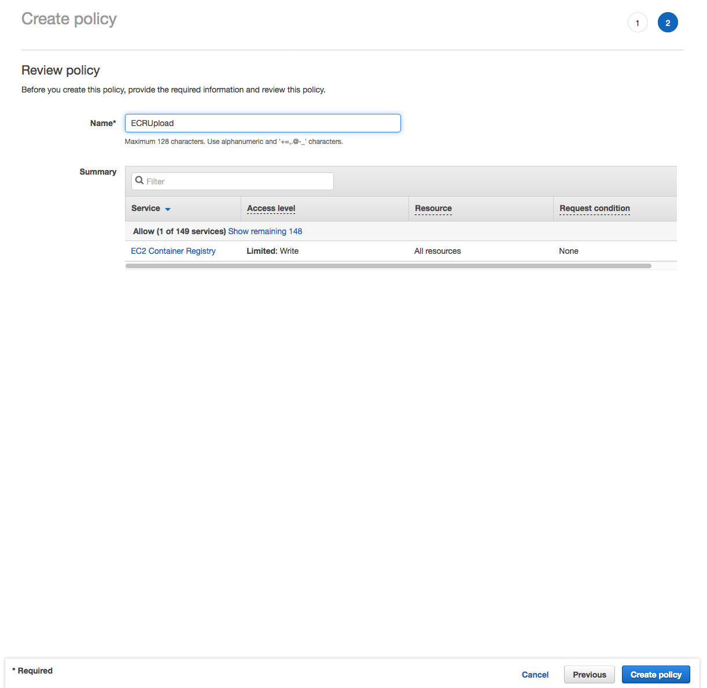
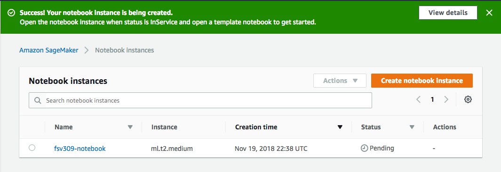
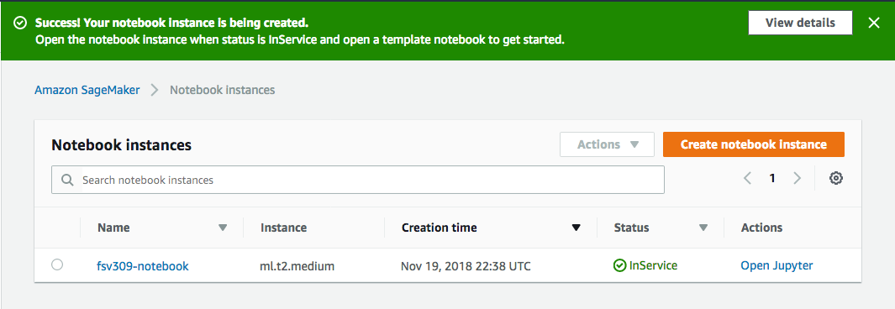
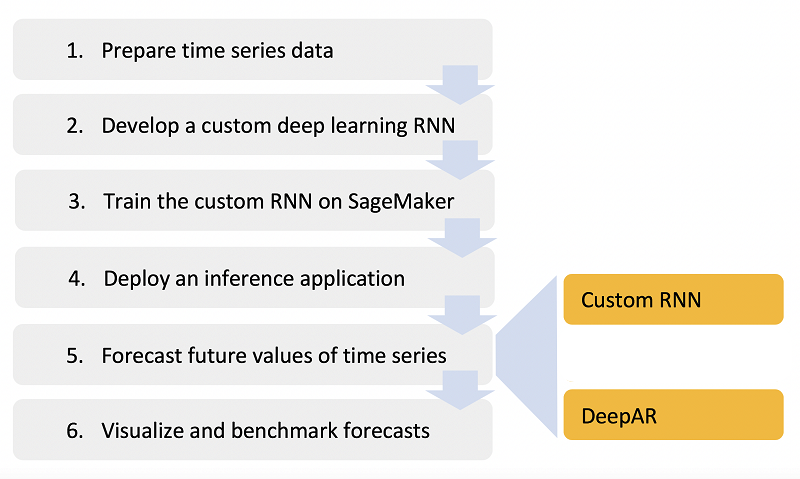

# Stock Prediction using Neural Network on Amazon SageMaker

## License Summary

This sample code is made available under a modified MIT license. See the [LICENSE](./LICENSE) file.

## Introduction

This is a sample workshop that demonstrates how to use Neural Network based algorithm for time series prediction. The workshop uses stock market data maintained by Deutsche Börse under [Registry of open data](https://registry.opendata.aws/deutsche-boerse-pds/) on AWS. This dataset contains stock movement data from EU market, containing 100+ stocks, updated by the minute. Data is available starting from July 2016.

Time series data can be analysed using a variety of techniques, ranging from a simple Multi Layer Perceptron, to a stacked Recurrent Neural Network, using forecasting methods such as Autoregressive Integrated Moving Average (ARIMA) or Exponential Smoothing (ETS). As a first attempt, we'll use a simple Recurrent Neural Network (RNN) model to predict the price of a single stock.

## Action Plan

[Amazon SageMaker](https://aws.amazon.com/sagemaker/) is the Machine Learning platform on AWS that provides infrastructure to run hosted Jupyter Notebooks. Being integrated with other storage and analytics services on AWS, data collection, preparation and visualization - the essential tasks for a successful Machine Learning project become secure, scalable and streamlined on SageMaker. 


In this workshop, we'll use SageMaker hosted notebooks to fetch the data from Deutsche Börse dataset, clean up and aggregate the data on [Amazon S3](https://aws.amazon.com/s3/) buckets. We'll also use [Amazon Athena](https://aws.amazon.com/athena/) to query the data and [Amazon QuickSight](https://aws.amazon.com/quicksight/) to visualize the data. This will allow us to develop an intuition about the nature of the data.

In addition to hosted Notebooks, SageMaker also provides managed training and hosting for Machine Learning models, using a variety of languages and libraries. In our first attempt, we'll use this functionality to containerize the training and prediction code, publish on an [Amazon ECR](https://aws.amazon.com/ecr/) repository, and host our custom model behind a SageMaker endpoint to generate prediction.

SageMaker also provides several built in algorithms, for image classification, regression and clustering of structured data, timeseries processing and natural language processing. In the later part of this workshop we'll use [DeepAR](https://docs.aws.amazon.com/sagemaker/latest/dg/deepar.html), which is a supervised learning algorithm for forecasting one-dimensional time series using RNN.

## Disclaimer

This workshop is not an exercise in statistical methods, neither does it attempt to build a viable stock prediction model that you can use to make money. However it does showcase the techniques that you can use on AWS Machine Learning platform.

## 1. Getting started

Since you will execute most of the workshop steps on a Jupyter Notebook hosted on SageMaker, start by creating a notebook instance on SageMaker from the AWS Console.

Refer to the [AWS Region Table](https://docs.aws.amazon.com/general/latest/gr/rande.html#sagemaker_region) to check the availability of SageMaker service, and choose to create the following infrastructure in any of the regions where it is available.
As of re:Invent-2018, SageMaker is available in the following regions:
- us-east-1 (Northern Virgina)
- us-east-2 (Ohio)
- us-west-1 (California)
- us-west-2 (Oregon)
- ca-central-1 (Canada)
- eu-west-1 (Ireland)
- eu-west-2 (London)
- eu-central-1 (Frankfurt)
- ap-northeast-1 (Tokyo)
- ap-northeast-2 (Seoul)
- ap-southeast-1 (Singapore)
- ap-southeast-2 (Sydney)
- ap-south-1 (Mumbai)
- us-gov-west-1 (AWS GovCloud)

### 1.1. Lifecycle configuration

Lifecycle configurations are small bootup scripts, that you can use to automate certain tasks when a Notebook instance in being created and/or being started. For this workshop, create a startup script to download pre-built notebooks from this Github repository onto your notebook instance. 

Configure this script to run on `Create notebook`.

  ```
  #!/bin/bash
  set -e
  git clone https://github.com/aws-samples/amazon-sagemaker-stock-prediction.git
  mkdir SageMaker/fsv309-workshop
  mv amazon-sagemaker-stock-prediction/container SageMaker/fsv309-workshop/container/
  mv amazon-sagemaker-stock-prediction/notebooks SageMaker/fsv309-workshop/notebooks/
  mv amazon-sagemaker-stock-prediction/images SageMaker/fsv309-workshop/images/
  rm -rf amazon-sagemaker-stock-prediction
  sudo chmod -R ugo+w SageMaker/fsv309-workshop/
  ```

<details>
<summary><strong>Step-by-step instructions (expand for details)</strong></summary><p>

  1. In the AWS Management Console choose **Services** then select **Amazon SageMaker** under Machine Learning.

  1. Choose **Lifecycle configurations** under the section **Notebook** on the left panel.
      

  1. Choose **Create configuration** to open the create dialog.

  1. Type the name `fsv309-lifecycle-config` in the `Name` field.

  1. In the tab **Create notebook**, type or copy-paste the `Create Notebook` script from above.
      

  1. Finish configuration by clicking **Create configuration**.

</p></details>


<b>Note:</b> If you niss to create a Lifecyle configuration or to attach the configuration to your Notebook instance, you can always run the above commands dircetly, into a Terminal window, from within your instance's Jupyter console.


### 1.2. Notebook instance
1. Use the lifecycle configuration to create a Notebook instance in a region of your choice.

1. Choose an instance class of smallest size, such as `ml.t2.medium`. Since you'll not use Notebook instance to execute training and prediction code, this will be sufficient. 

1. If you do not have an IAM role created prior with all the necessary permissions needed for SageMaker to operate, create a new role on the fly.

1. The IAM role you choose to use with the Notebook needs to be authorized to create ECR repository and upload an container image to the repository. Therefore add the following permissions to the `IAM Role` that you'll be using for your Notebook instance:
  - ecr:CreateRepository
  - ecr:InitiateLayerUpload
  - ecr:UploadLayerPart
  - ecr:CompleteLayerUpload
  - ecr:PutImage


1. Optionally you can choose to place your instance within a VPC and encrypt all data to be used within notebook to be encrypted. For the purpose of the workshop you can proceed without these mechanisms.

<details>
<summary><strong>Step-by-step instructions (expand for details)</strong></summary><p>

  1. In the AWS Management Console choose **Services** then select **Amazon SageMaker** under Machine Learning.

  1. Choose **Notebook instances** under the section **Notebook** on the left panel.
      

  1. Choose **Create notebook Instance** to open the create dialog.

  1. Type the name `fsv309-notebook` in the `Name` field.

  1. From `Notebook instance type dropdown`, choose `ml.t2.medium`.

  1. From `IAM role` dropdown, choose `Create a new role`.

  1. In the dialog that pops up, select the radio button for `Any S3 bucket`, .
      

  1. Choose **Create Role** to return to notebook creation dialog. Notice that SageMaker creates a new execution role with the current timestamp appended at the end of its name, and that this role remains selected under `IAM role` dropdown.

  1. From the `Lifecycle configuration` dropdown, choose the configuration named `fsv309-lifecycle-config`, that you created in section-1.1.

  1. Immediately below the `IAM Role` field, you would see a success message in a green message box, with the name of your newly created IAM role displayes as a hyperlink. Click on the hyperlink to open the role in IAM console in a new browser tab.

  1. From the IAM console page that opens in a new browser tab, displying the role summary, choose **Add Inline policy**
      

  1. On **Create policy** page, click on **Choose a service**
      

  1. In the suggestive search box, type "EC2", to have the list of displayed service filtered down, then choose **EC2 Container Registry** from the narrowed down list.
      

  1. Under `Actions` section, expand `Write` Access level

  1. Select actions - **CreateRepository**, **InitiateLayerUpload**, **UploadLayerPart**, **CompleteLayerUpload** and **PutImage**
      

  1. Under `Resources` section, click on the text displaying `You chose actions that require the policy resource type`.

  1. Choose **All resources** radio button under `Resources` section.
      

  1. Choose **Review policy** at the bootom right-hand corner of the screen.

  1. In the review screen, ensure there are no errors or warnings displayed.

  1. Type a name of the policy in `Name` field, Choose a meaningful name, such as `ECRUpload`.

  1. Choose **Create policy** at the bootom right-hand corner of the screen.
      

  1. Close the browser tab to return to the previous tab for SageMaker console.

  1. Leave the VPC selection and Encryption Keys empty for the purpose of this workshop, and choose **Create notebook instance** to finish creation.
      

  1. You'll be returned to the list of notebooks, with the status of curren notebook shown as `Pending`. Wait till the status changes to `InService`, before proceeding to the next section.
      

  1. When the status of your notebook shows `InService`, click on the `Open Jupyter` link under `Actions` column to open the Jupyter Notebook on your instance and proceed to the following sections of this workshop.
      

</p></details>

<!-- ### 1.3. Athena table
Athena allows you to query data directly from S3 buckets, using standard SQL compatible queries. Use the following DDLs to create external table in Athena, and a view containing the fields of interest. Using this view, you can then run queries directly on stock market data as stored in S3 buckets maintained by Deutsche Börse.

Use the DDL provided below to create an Athena table, which currently wouldn't display any data, but you'll be able to run queries and generate QuickSight dashboard against this table once the following data preparation stage is completed.

<details>
<summary><strong>Create tables (expand for details)</strong></summary><p>

1. DDL to create hourly stock data table.

    ```      
    CREATE EXTERNAL TABLE `stockdata_hourly` (
      `CalcDateTime` string, 
      `Mnemonic` string, 
      `MinPrice` float, 
      `MaxPrice` float, 
      `StartPrice` float, 
      `EndPrice` float, 
      `TradedVolume` float, 
      `NumberOfTrades` float)
    ROW FORMAT SERDE 
      'org.apache.hadoop.hive.serde2.OpenCSVSerde' 
    WITH SERDEPROPERTIES ( 
      'separatorChar'=',',
      'quoteChar'='"',
      'skip.header.line.count'='1') 
    STORED AS INPUTFORMAT 
      'org.apache.hadoop.mapred.TextInputFormat' 
    OUTPUTFORMAT 
      'org.apache.hadoop.hive.ql.io.HiveIgnoreKeyTextOutputFormat'
    LOCATION
      's3://<Your S3 Bucket Name>/dbg-stockdata/source/H/'
    TBLPROPERTIES (
      'classification'='csv')
    ```

1. DDL to create daily stock data table.

    ```      
    CREATE EXTERNAL TABLE `stockdata_daily` (
      `CalcDateTime` string, 
      `Mnemonic` string, 
      `MinPrice` float, 
      `MaxPrice` float, 
      `StartPrice` float, 
      `EndPrice` float, 
      `TradedVolume` float, 
      `NumberOfTrades` float)
    ROW FORMAT SERDE 
      'org.apache.hadoop.hive.serde2.OpenCSVSerde' 
    WITH SERDEPROPERTIES ( 
      'separatorChar'=',',
      'quoteChar'='"',
      'skip.header.line.count'='1') 
    STORED AS INPUTFORMAT 
      'org.apache.hadoop.mapred.TextInputFormat' 
    OUTPUTFORMAT 
      'org.apache.hadoop.hive.ql.io.HiveIgnoreKeyTextOutputFormat'
    LOCATION
      's3://<Your S3 Bucket Name>/dbg-stockdata/source/D/'
    TBLPROPERTIES (
      'classification'='csv')
    ```

</p></details>


<details>
<summary><strong>Create views (expand for details)</strong></summary><p>

1. Since the table infers all date columns as strings and number columns as decimals, use the following DDL to create an hourly view, casting the columns to appropriate data types.    

    ```      
    CREATE OR REPLACE VIEW "stockdata_hourly_view" AS
    SELECT date_parse(stock.calcdatetime, '%Y-%m-%d %H:%i:%s') AS CalcDateTime,
            stock.Mnemonic as Mnemonic,
            stock.MinPrice as MinPrice,
            stock.MaxPrice as MaxPrice,
            stock.StartPrice as StartPrice,
            stock.EndPrice as EndPrice,
            cast(stock.TradedVolume as integer) as TradedVolume,
            cast(stock.NumberOfTrades as integer) as NumberOfTrades
    FROM stockdata_hourly AS stock
    ```

1. Since the table infers all date columns as strings and number columns as decimals, use the following DDL to create a daily view, casting the columns to appropriate data types.    

    ```      
    CREATE OR REPLACE VIEW "stockdata_daily_view" AS
    SELECT date_parse(stock.calcdatetime, '%Y-%m-%d') AS CalcDateTime,
            stock.Mnemonic as Mnemonic,
            stock.MinPrice as MinPrice,
            stock.MaxPrice as MaxPrice,
            stock.StartPrice as StartPrice,
            stock.EndPrice as EndPrice,
            cast(stock.TradedVolume as integer) as TradedVolume,
            cast(stock.NumberOfTrades as integer) as NumberOfTrades
    FROM stockdata_daily AS stock
    ```

</p></details> -->

## 2. Data preparation

Deutsche Börse Public Data Set consists of trade data aggregated at one minute intervals. While such high fidelity data could provide an excellent insight and prove to be a valuable tool in quantitative finanical analysis, for the scope of this workshop data aggregated at a larger interval rate, such as daily and hourly, would be more convenient to deal with.

Moreover, the source dataset is organized into hierarchical S3 bucket prefixes, according to date and time and contains some missing days, hours, either due to non-trading windows, or due to errors in data collection. In the [dbg-data-preperation](notebooks/dbg-data-preperation.ipynb) notebook, you'll download raw data from source for an interval of your chosing, resample the data at hourly and daily intervals, and upload to your own S3 bucket. 

Within this notebook, you'll also find code to that you could use to grab the cleaned data directly from an S3 bucket maintained for this workshop. This alternative will save you time because you do not have to execute code to obtain data from the source and cleanse it yourself. In order to use the second option, execute the cells in the notebook from section **2.5** onward.

Whichever way you choose, proceed to obtain the data by executing code in [dbg-data-preperation](notebooks/dbg-data-preperation.ipynb) from your SageMaker Notebook instance, and come to the next section of this readme when finished.

## 3. Data analysis

After we prepared the data, we did some preliminary analysis and observed that :
- Minimum and maximum prices during an interval are possible indicators of closing Price, in that during an upward trend of prices, closing price is closer to maximum price, whereas during a downward trend it is closer to minimum price.
- Minimum and maximum price during an interval are possible indicators of opening Price, in that during an upward trend of prices, opening price is closer to minimum price, whereas during a downward trend it is closer to maximum price.
- Opening price during an interval is possible indicator of closing Price, in that during an upward trend of prices, closing price is above opening price, whereas during a downward trend it is below opening price.

The insights above are useful becasue while predicting closing price of stocks, these indicates that we could use these other metrices as determining features that has influence on the target metric. We'll use this insight when we build the deep neural network models in next two sections.

As one would imagine individual stocks' movement doesn't exist in vaccuum. Often times, companies in related industries, or in similar businesses, follow similar pattern. IF we could find similar companies' stocks, it would allow us to use these other stocks as exogenous time series, while predicting a particular stock as main time series.

Empirically we can assume that companies in similar industries, such as automobile or telecommunication industry would have some bearing on each others' price movements. In order to confirm this intuition, you can execute the code in [dbg-stock-clustering](notebooks/dbg-stock-clustering.ipynb) notebook, to have the similar stocks clustered, using the [**HDBSCAN**](https://hdbscan.readthedocs.io) algorithm.

Although clustering result may vary depending on the time period you choose while running the algorithm, and the similarity function you choose, for the stocks in this dataset, they should be clustered somewhat similarly as shown in the diagram below.

<details>
<summary><strong>Clustered stock view (expand for diagram)</strong></summary><p>

Some prominent clusters are highlighted manually in this image, based on the clustering algortihm output.

  

</p></details>
<br>

To see for yourself, you can execute the code in [dbg-stock-clustering](notebooks/dbg-stock-clustering.ipynb) from your SageMaker Notebook instance and come to the next section of this readme when finished.


## 4. Custom RNN

Forecasting the evolution of events over time is essential in many applications, such as financial analysis, climatology, logistics, and supply chain management. Although predicting the future is hard, and requires availability of reliable and effective indicators, the infrastructure tools and algorithmic techniques are readily available on AWS. 

Following two modules in this workshop will provide you with an understanding of how **Recurrent Neural Network (RNN)** based deep learning algorithms can be applied to sequential data, such as the stock market data. You'll also know where to start if you decide to use an AWS provided algorithm for this purpose.

At a high level, you'll follow the plan as described in the session plan diagram:

  

As a first step, you'll use a custom RNN based algorithm, following the [dbg-custom-rnn](notebooks/dbg-custom-rnn.ipynb) notebook. Since the data preparation steps have already been completed in previous modules, you'll simply submit your model to SageMaker for training. Once trained, you'll deploy the model to generate predictions, forecast future stock values, and visualize within the notebook to see the performance of the model you deployed.

Although it is possible to execute training using the compute available in your own Notebook instance, containerizing your code and submitting to SageMaker for training has a number of advantages. Managed training and hosting services on SageMaker not only gives you flexibility of choosing the appropriately sized compute, it also ensures you only pay for what you actually use, Moreover, this approach makes it easier for data engineers to establish model pipelines by allowing them to automated these tasks in a repeatbale fashion.

You can refer to [SageMaker build framework](https://github.com/aws-samples/aws-sagemaker-build) as a reference implementation of CI/CD framework for  automated build and deployment of machine learning models.

For now, you can proceed to train and deploy the custom RNN model following the code in the [dbg-custom-rnn](notebooks/dbg-custom-rnn.ipynb) notebook. Once finished, you can come back to the following section of this readme to explore another approach, using one of SageMaker native algorithms, as provided by AWS, free of charge.


## 5. SageMaker DeepAR

The previous module served to demonstrate that even without covariate data from meaningful external source, using RNN based model, it is possible to predict stock price movements better than random guess. There are however better algorithms that might be able to improve upon the forecasting results obtained by our crude RNN based model, as you'll see in the [dbg-deepar](notebooks/dbg-deepar.ipynb) notebook.

Classical forecasting methods, such as **ARIMA (Autoregressive Integrated moving average)**, attempts to predict a future value by regressing a target time series itself on some lag. This technique is further improved by **ARIMAx**, which includes covariates and does the regression on the lag of the series itself and the other related time series. In both cases, another part of regression is done on some lag of random fluctuations around the moving average, thereby accounting for the stochastic part (as in moving average - MA).

One major drawback in both of these classical approaches is that they fit a single model to each individual time series. In reality however, such as in the case of the stock market data we are exploring in this workshop, we encounter many similar time series across a set of cross-sectional units. It is beneficial, in such cases, to train a single model jointly over all these time series.

[Amazon SageMaker DeepAR](https://docs.aws.amazon.com/sagemaker/latest/dg/deepar.html) follows this approach and can train a model with hundreds of time series. Once trained, such a model can then be used to forecast any of the time series' values into the future. As compared to our custom RNN approach, you would not need to train different models to predict movements of different stocks.

A recent feature addition in DeepAR is inclusion of dynamic features, which works in a way similar to how we used covariates in our custom RNN based model. Using dynamic features, as supporting time series' that help explain the variability of the main time series, you can easily improve upon the prediction accuracy. Values of dynamic feature series' however have to be known for the forecast horizon. Although you will be using metrices from the same data set as dynamic features in this workshop, it is not realistic to know the values of those in advance, throughout the forecast horizon. 

In order to adopt the techniques you learn in this workshop to a real world use case, you might use data such as forward looking bond prices, federal interest rate, companies' revenue or sales guidance, option pricing etc. DeepAR's support of dynamic feature would then allow you to incorporate such additional knowledge about future into your model, thereby allowing you to forecast the futre prices better.

You can now proceed to explore the final approach, of predicting stock price movements using DeepAR, following the code in the [dbg-deepar](notebooks/dbg-deepar.ipynb) notebook.

